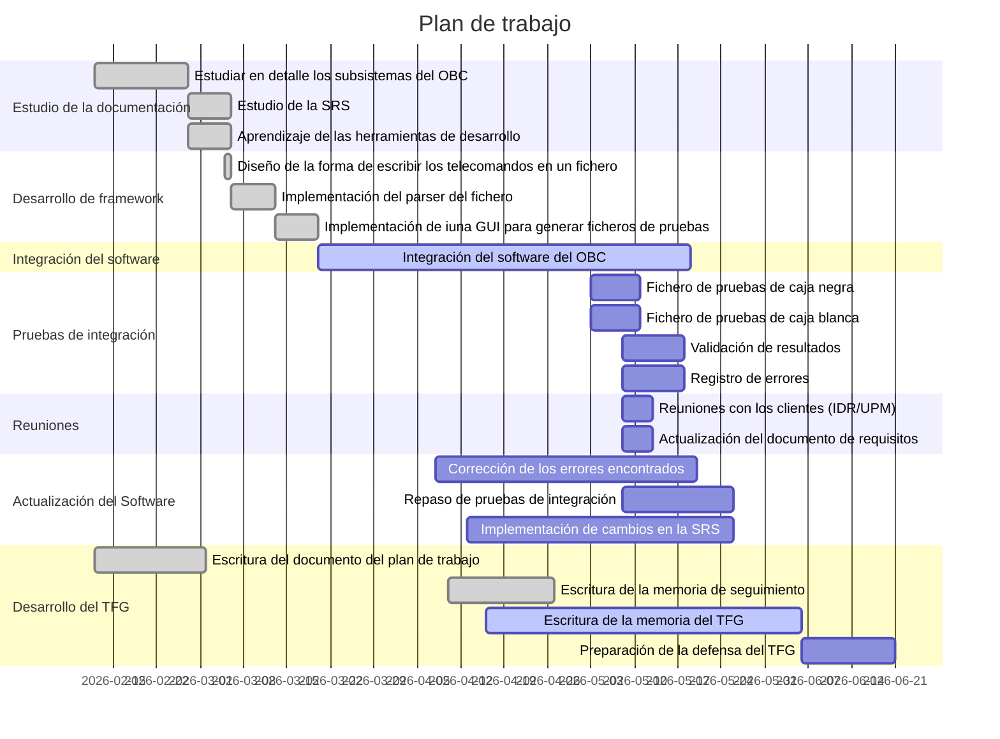

```mermaid
gantt
dateFormat DD-MM
title Plan de trabajo
section Estudio de la documentación
Estudiar en detalle los subsistemas del OBC : done, subsistemas, 12-02, 15d
Estudio de la SRS : done, SRS, 27-02, 7d
Aprendizaje de las herramientas de desarrollo: done, herramientas, 27-02, 7d

section Desarrollo de framework 
Diseño de la forma de escribir los telecomandos en un fichero: done, fichero, 05-03, 1d
Implementación del parser del fichero : done, XML, 06-03, 7d
Implementación de iuna GUI para generar ficheros de pruebas: done, GUI, 13-03, 7d

section Integración del software
Integración del software del OBC: active, integracion, 20-03, 60d

section Pruebas de integración 
Fichero de pruebas de caja negra: active caja_negra, 03-05, 8d
Fichero de pruebas de caja blanca: active caja_blanca, 03-05, 8d
Validación de resultados: validacion, 08-05, 10d
Registro de errores: registro_errores, 08-05, 10d

section Depuración

	
section Reuniones
Reuniones con los clientes (IDR/UPM): reuniones, 08-05, 5d

Actualización del documento de requisitos: actualizacion_SRS, 08-05, 5d
section Actualización del Software
Corrección de los errores encontrados: bug_fixes, 08-04, 42d
Repaso de pruebas de integración: repaso, 08-05, 18d	
Implementación de cambios en la SRS: implementacion_cambios, 13-04, 43d

section Desarrollo del TFG
Escritura del documento del plan de trabajo: done, plan_trabajo, 12-02, 02-03
Escritura de la memoria de seguimiento: done, memoria_seguimiento, 10-04, 27-04
Escritura de la memoria del TFG: active,  memoria_tfg, 16-04, 06-06
Preparación de la defensa del TFG: defensa_tfg, after memoria_tfg, 21-06

```
