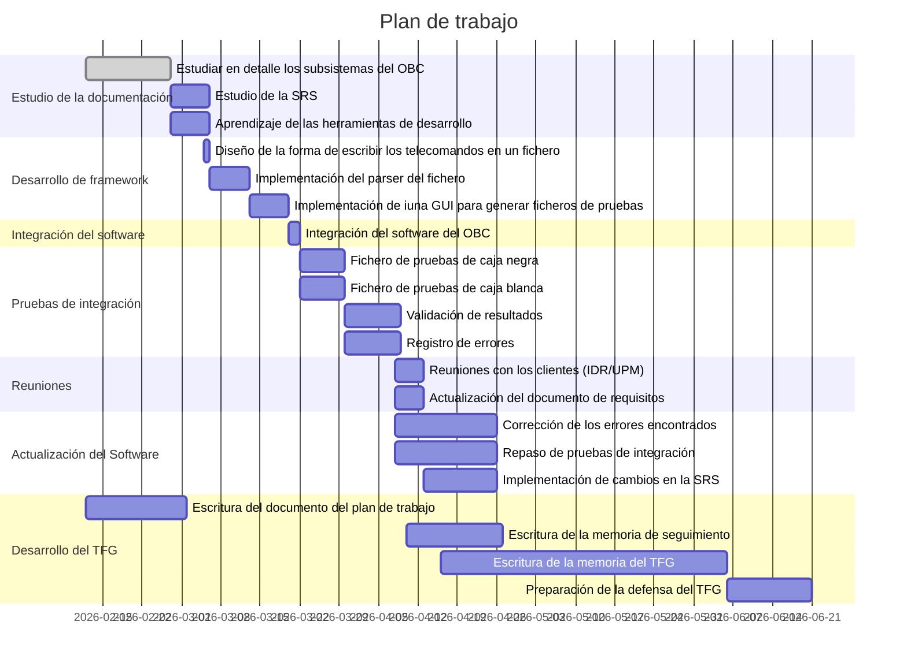

```mermaid
gantt
    dateFormat DD-MM
    title Plan de trabajo
    section Estudio de la documentación
    Estudiar en detalle los subsistemas del OBC : done, subsistemas, 12-02, 15d
    Estudio de la SRS : active SRS, 27-02, 7d
    Aprendizaje de las herramientas de desarrollo: herramientas, 27-02, 7d

    section Desarrollo de framework 
	Diseño de la forma de escribir los telecomandos en un fichero: fichero, 05-03, 1d
    Implementación del parser del fichero : XML, 06-03, 7d
    Implementación de iuna GUI para generar ficheros de pruebas: GUI, 13-03, 7d

	section Integración del software
	Integración del software del OBC: integracion, 20-03, 2d

    section Pruebas de integración 
    Fichero de pruebas de caja negra:  caja_negra, 22-03, 8d
    Fichero de pruebas de caja blanca:  caja_blanca, 22-03, 8d
    Validación de resultados: validacion, 30-03, 10d
	Registro de errores: registro_errores, 30-03, 10d

    section Depuración

	
	section Reuniones
	Reuniones con los clientes (IDR/UPM): reuniones, 08-04, 5d

	Actualización del documento de requisitos: actualizacion_SRS, 08-04, 5d

	section Actualización del Software
	Corrección de los errores encontrados: bug_fixes, 08-04, 18d
Repaso de pruebas de integración: repaso, 08-04, 18d	
Implementación de cambios en la SRS: implementacion_cambios, 13-04, 13d
	
	
    section Desarrollo del TFG
Escritura del documento del plan de trabajo: plan_trabajo, 12-02, 02-03
Escritura de la memoria de seguimiento: memoria_seguimiento, 10-04, 27-04
    Escritura de la memoria del TFG: memoria_tfg, 16-04, 06-06
	Preparación de la defensa del TFG: defensa_tfg, after memoria_tfg, 21-06
```
